# Automation and company-specific AI

Clarity accepts completed recordings automatically, analyzes them using a workspace configuration, and links proposed improvements to evidence. The **Automation & AI** page explains the flow and exposes analysis settings.

## What runs automatically

```mermaid
flowchart LR
  A[Call ends] --> B[Source event or watched folder]
  B --> C[Upload-only ingestion API]
  C --> D[Private audio storage and outbox]
  D --> E[Kafka and Temporal]
  E --> F[Local transcription and speaker separation]
  F --> G[Privacy masking]
  G --> H[Chosen AI plus company instructions]
  H --> I[Local embeddings and issue grouping]
  I --> J[Evidence-linked recommendations]
  J --> K[Human review]
  K --> L[Configured business tools]
```



No operator is needed between receipt of a recording and completion of its analysis. The source must first be connected. Summary refreshes remain explicit reporting jobs; external actions still require review. Existing Jira, Slack and CRM delivery adapters remain the downstream integration path.

## Connect a source

An ADMIN creates a source in Automation & AI. The API returns an upload-only token once, stores only its SHA-256 hash, and scopes it to one tenant and source. Tokens can be revoked. They cannot read calls, change settings or approve recommendations. Guest demo users cannot create production tokens.

Send `POST /api/v1/ingestion/recordings` with:

- `Authorization: Bearer <source token>`
- `Idempotency-Key: <stable event identifier, 8 to 128 characters>`
- Multipart part `audio`: recording bytes.
- Multipart part `metadata`, content type `application/json`: the same contract as `/calls/import`.

```json
{
  "title": "Customer support call",
  "customerId": "customer-reference",
  "agent": "Support team",
  "department": "Customer support",
  "recordedAt": "2026-10-09T10:00:00Z",
  "language": "en",
  "speakers": 2,
  "sample": false
}
```

A 202 response returns the queued call ID. Repeated delivery with the same event, audio and metadata returns the same call. A changed payload with that key returns 409. Keys are namespaced by source. File signatures and the 100 MB upload limit are validated. The processing worker applies its duration limits. Source status records the last accepted upload, not the recorder's connection health.

Only this machine endpoint is exempt from session CSRF protection; it requires a valid bearer token even if a browser session is present. All existing session writes retain CSRF protection.

### Watched-folder connector

For systems that export files, run `scripts/ingest-recordings.py` near the recorder. Write the audio first, then atomically rename a manifest to `*.ready.json` after the recording is complete:

```json
{
  "eventId": "stable-recorder-event-123",
  "audioFile": "call-123.wav",
  "metadata": {
    "title": "Customer support call",
    "customerId": "customer-reference",
    "agent": "Support team",
    "department": "Customer support",
    "recordedAt": "2026-10-09T10:00:00Z",
    "language": "en",
    "speakers": 2,
    "sample": false
  }
}
```

Set `CSI_INGEST_TOKEN` through the service manager or secret store. Run:

```sh
uv run --project worker python scripts/ingest-recordings.py /recordings \
  --endpoint https://clarity.example.com/api/v1/ingestion/recordings
```

The connector scans every 30 seconds, retries unacknowledged uploads, and writes receipts only after acceptance. Keep its `.clarity-receipts` folder on durable storage. It never deletes recordings. Run one instance per watched folder; use `--once` for a single scan. Event IDs must be unique and immutable. Native vendor webhooks that send only recording URLs need a vendor-specific connector to fetch the audio and submit this contract. The API intentionally does not fetch arbitrary URLs.

## Choose a model

Local Ollama remains the default. The API and worker can share a `CSI_AI_PROVIDERS` environment variable containing approved providers:

```json
[
  {
    "id": "company",
    "label": "Company AI gateway",
    "kind": "openai-compatible",
    "baseUrl": "https://ai.example.com/v1",
    "model": "company-model",
    "external": true,
    "tokenEnvironment": "COMPANY_AI_TOKEN"
  }
]
```

Set the referenced token only in the worker environment. In VPS Compose, put the provider JSON in `.env.vps` and the worker credential in the existing private `.env.integrations` file. Restart API and worker with matching provider definitions. A provider address cannot be entered by a guest or supplied by a transcript. URLs must not contain credentials, queries or fragments. External providers require HTTPS, workspace ADMIN selection and the external-analysis setting. HTTP is supported for deployment-controlled internal gateways with `external: false`; the operator is responsible for that classification and network isolation.

Compatible providers must implement `POST <baseUrl>/chat/completions`, JSON schema `response_format`, `messages`, `model`, `temperature` and `max_tokens`, and return `choices[0].message.content`. This supports compatible self-hosted services and gateways to cloud models. It is not a native adapter for every vendor or every model. Providers with other contracts need a gateway or an adapter. The worker validates the result and evidence references and fails on unsupported or invalid output rather than inventing success. It does not follow redirects or use ambient HTTP proxy settings.

Raw audio, speech processing, PII masking and embeddings stay in the local pipeline. An approved external analysis provider receives masked transcript text or summary evidence and the company instructions. Automated masking can miss identifiers. Local demo inference cannot be switched to an external provider. Temperature and output-token limits affect individual responses, not a guaranteed spending cap; monitor costs in the chosen provider.

## Customize and export

ADMIN users and isolated live-demo users can edit company context, analysis rules, output language, temperature and output-token limits. The offline preview stores settings in browser storage. In the live app settings are tenant-scoped, audited and versioned in PostgreSQL. Optimistic version checks reject conflicting edits.

Saving changes affects new calls and new support-summary jobs. Each job snapshots the configuration, model and composed prompts. Existing recordings and prepared demo reports remain unchanged. A retry uses that snapshot. Changing a configured gateway model under the same provider ID causes older jobs to fail rather than silently switching model.

The preview shows the draft system prompts without running inference or saving them. **Export saved skill** downloads the saved profile, composed prompts, expected output schemas, workflow and read-only evidence API contracts. An external agent runner must supply authentication and implement tool execution. Exporting a file does not deploy an autonomous agent or bypass existing permissions.

The shared contract lives in `server/src/main/resources/agent/skill.json`, consumed by API, worker and offline preview. Keep its schemas synchronized with the worker Pydantic schemas. Company preferences guide the model; they cannot disable structural output validation, evidence checks, tenant isolation or human approval of downstream actions. Model compliance with subjective company rules should be evaluated with representative recordings.

## Validation

- Backend tests exercise profile version conflicts, tenant isolation, role checks, CSRF and token revocation.
- Worker tests exercise instruction composition, provider policy checks, HTTP contracts, output parsing and connector retry receipts.
- Browser tests exercise editing, preview, persistence, saved-version export, storage errors and responsive accessibility.
- No external provider is contacted by these tests. Live provider quality, cost and compatibility must be checked with the company's chosen deployment.
